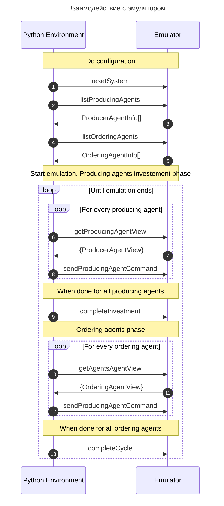

# Запуск приложения

## 🐳 Запуск через Docker

Для запуска приложения через Docker выполните следующие шаги:

1. Убедитесь, что у вас установлен Docker

2. Запустите приложение с помощью скрипта:

   ```bash
   ./start.sh
   ```

3. После запуска приложения, документация API доступна по адресу:
   ```
   http://localhost:8080/docs/
   ```
   Swagger UI предоставляет интерактивный интерфейс для:
   - Просмотра всех доступных эндпоинтов
   - Тестирования API запросов
   - Изучения форматов запросов и ответов

### Дополнительные опции запуска:

- Запуск в фоновом режиме:

  ```bash
  ./start.sh --detach
  ```

- Запуск на другом порту:

  ```bash
  ./start.sh --port 3000
  ```

- Запуск определенной версии:

  ```bash
  ./start.sh --tag latest
  ```

- Просмотр всех опций:
  ```bash
  ./start.sh --help
  ```

### Управление контейнером:

- Просмотр логов:

  ```bash
  docker logs tokenomics
  ```

- Остановка приложения:
  ```bash
  docker stop tokenomics && docker rm tokenomics
  ```

---

# Документы

[Записи дизайн-решений](/docs/desicion-records.md#dr002-размещение-заказа)
[Правила (DRAFT)](/docs/game-rules.md)

# Глоссарий

## Продукт

Является результатом производства

По назначению делится на два типа:

- Потребительский - предназначен для удовлетворения потребностей потребителей
- Инвестиционный - предназначен для расширения/восстановления произодственных мощностей

## Заказ

Заявка на производство продукта

- Имеет стоимость с токенах

- Заказ может выполняться на протяжении нескольких тактов, у него есть внутренне состояние необходимиое для хранения готовой продукции.
- Так же состояние хранит необходимые данные для повторных ставок в случае начала частичного производства заказа

## Мощность

Абстрактые единицы **заданного типа**, необходимые для производства продукта.

- Измеряется единицами в такт.

- _Мощности разных типов разнокачественные и не могут арифметически суммироваться, так как по сути производят разные продукты_

## Технологическая карта (ТК)

Определяет сколько единиц мощности и какого типа необходимо для производства продукта.

- ТК не изменяются системой в процессе моделироания, а задаются **ИЗВНЕ**.

## Токен

Средство обмена и сбережения (для потребителей), преследущее две цели:

1. Оповещение системы о предпочтениях потребителей через распределение токенов между потребительскими заказами
2. Регулирование распределения доступных мощностей между заказами (защита от greedy агентов-заказчиков)

## Эмиссия

Токены эмитируются каждый такт

- Пока количество статично и задается **ИЗВНЕ**
- Часть токенов равномерно распределяется между всеми потребителями
- Оставшиеся токены поступают в **инвестиционный пул** токенов, из которых агенты-производители могут получить токены для приобритения инвестиционных продуктов.
- Пропорция распределения между пользователями и инвестиционным пулом **пока** определяется константно как 1:1. В последующем позможна динамическая корректировка пропорции распределения токенов.
- Токены в инвестиционном пуле неизрасходованные на конец такта в следуюищий такт **НЕ ПРЕНОСЯТСЯ**

## Потребитель

Обменивает личные токены на продукты производимые системой.

- **ЯВЛЯЕТСЯ ВНЕШНИМ К СИСТЕМЕ**
- Формирует заказы в соответвии с ценами созданными в системе, но не сводит все свое поведение к реакции на цены, а вносит еще элемент личных предпочтений
- Может сберегать и переносить полученные токены из такта в такт
- Каждый такт структура заказов конкретного потребителя меняется случайным образом, но объем изменений не должен превышать заданный процент
- На первом этапе его поведение можно эмулировать вероятностно, на основе карты предпочтений (продукты имеют веса и заказы генерируются с вероятностью пропорциональной с весу продукта)
- В дальнейшем возможно необходимо моделировать их поведений через агентов-ассистентов, для более качественного обучения агентов внутри системы, но пока считаем что потребитель знает что он хочет и мы даем ему это максимально быстро.

## Агент-заказчик (АЗ)

Получает заказы и **предлагает** токены, выделенные на заказ, в виде ставок различным агентам-производителям, мощности которых необходимы для производства заказанного продукта.

- Добавлен с систему в соответствии с [DR001](/docs/desicion-records.md#dr001-агентов-заказичики-vs-централизация)
- **ЯВЛЯЕТСЯ ВНУТРЕННИМ К СИСТЕМЕ** и целью для обучений эффективному распределению токенов между агентами-производителями
- Если ни одна из ставок по заказу не была принята, то токены возвращаются потребителю.
- Размещение заказа осуществляеется с соответвстии с [DR002](/docs/desicion-records.md#dr002-размещение-заказа)

## Агент-производитель (АП)

Производит продукты на мощностях заданного типа

- **ЯВЛЯЕТСЯ ВНУТРЕННИМ К СИСТЕМЕ** и целью для обучения соблюдения баланса между расширением, восстановлением и производстом продуктов
- **ИЗВНЕ ЗАДАЕТСЯ:**

  - количество производителей в системе
  - тип мощности
  - начальное значение мощности
  - процент деградации мощности
  - процент восстановления мощности в результате инвестиции
  - прирост мощности в результате инвестиции

- Выбирает и берет в работу наиболее приоритетные ставки от АЗ (пока можно задать приоритет по количеству токенов на запрашиваемую единицу мощности)
- Может работать над заказом несколько тактов подряд, в этом случае мощности доступные для новых заказов ограничены остатком мощности от уже выполняемого заказа
- В случае принятия решения о необходимости инвестирования берет токены из инвестиционного пула токенов и формирует заказ

## Цена отсечения (ЦО)

Минимальная цена единицы мощности взятая АП в работу в заданный такт

Пример: Агент-производитель с мощность 12 единиц
На этот продукт он в этом такте получил 10 нарядов на 20 единиц (каждый наряд на 2 единицы мощности), с токенами 5, 5, 4, 4, 3, 2, 1, 1, 1, 1
Он взял самые приоритетные. Наряд с минимальной ценой взятый в работу стоит 2 токена, в результате цена отсечения составила `2 (стоимость наряда) / 2 (мощность по наряду) = 1` токен.

# Эмулятор

Эмулятор запускается в docker контейнере и предоставляет HTTP API для взаимодействия.

[Контракт API в формате OpenAPI](/emulation/swagger.yaml)

В диаграмме последовательности ниже имена операций соответвуют `operationId` в OpenAPI контракте


