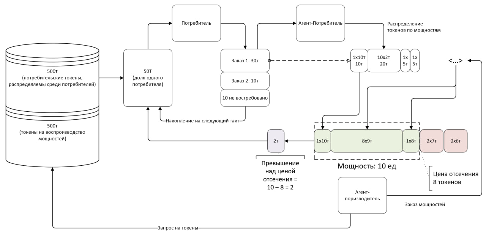

# Смотрите, как я вижу проблему / задачу.

1. У нас есть некоторые правила игры. Мы их написали/обсудили прошлый раз. Они упрощены по сравнению с реальностью, но их можно произвольно усложнять, постепенно приближая к реальности. Игра кооперативная.

2. Нам надо научить программных агентов, которые охрененно играют в эту игру. И убедиться, что при этом не возникнет неожиданных "побочек", то есть что наша result machine не превращает весь мир в скрепки.

3. Обучать агентов хорошо бы автоматически через эволюцию. Это означает, что надо иметь

- программную реализацию правил и процесса игры (т.е. окружение)
- автоматизированный процесс многократного запуска игры с агентами с разными вариациями в поведении
- систему отбора и переноса более успешных вариаций поведения

Первым пунктом в этом списке идет формализация требований к программному окружению, то есть четкое определение правил игры.
На этом этапе проверять их работу можно самим (без программных агентов). А вот далее "запускать" туда агентов должен уметь Сергей, который ровно то же делал с Doom.

Что касается UI и "токенов", то вроде бы я все достаточно прозрачно в постановке обозначил:

1. потребительские токены распределяются потребителям поровну, так как моделируюется безнаемная экономика
2. ничего общего с "мнениями" токены не имеют, это просто право на долю "машинного времени"
3. человека как наемного работника можно рассматривать как одного из производителей, но тогда там появляются определенные "петли" обратных связей, и это усложнение модели можно обсудить на каком-то следующем этапе (фактически модель должна повышать скорость удовлетворения потребностей общества с минимизицией использования "живых инструментов")

# MVP Модель одноуровневой системы:

Делаем дискретную систему (пошаговую).

В системе есть
m конечных потребителей
n агентов-производителей
m+n агентов-потребителей (обслуживают как конечных потребителей, так и агентов-производителей)
биржа

**актор может сочетать в себе несколько ролей**

Система эмитирует X (например 1 млн) токенов в такт.
Часть токенов согласно коэффициенту k распределяется поровну между конечными потребителями (коэффициент пока фиксированный, потом может быть динамический, за который будет отвечать отдельный агент).

Конечные потребители генерируют спрос в виде набора заказов, между которыми они распределяют свои токены. Первое состояние выбираем случайно, изменения каждый такт проходят плавно (меняется не более j процентов заказов).

Каждый заказ распадается на потребность в мощностях разных агентов-производителей (x единиц мощности каждого агента-производителя). Для простоты пока откажемся от заданной последовательности их потребления (введем потом).

Агент-потребитель размещает заказ на эти мощности, разделяя сумму токенов, выделенных на заказ конечным потребителем, между запросами на мощность агентов-производителей.
Например: Заказ c-1, сумма 100 токенов.
Агент p-1: 3 единицы мощности по 10 токенов
Агент p-2: 10 единиц мощности по 5 токенов
Агент p-3: 5 единиц мощности по 4 токена

Каждый агент-производитель имеет

- ограниченную мощность, измеряемую в единицах в такт;
- скорость деградации (уменьшение мощности в единицах в такт);
- функцию заказа для воспроизводства и расширения (количество единиц нужных мощностей других агентов, необходимое для увеличения его мощности на сколько-то единиц).

Он выступает также и потребителем с особым заказом: его заказ состоит в воспроизводстве собственной мощности или ее расширении. Для этого он размещает заявку на потребительские токены в указанном размере. Токены из той части текущей эмиссии, что не была распределена между потребителями (а также остатка по тем, что не были размещены потребителями в заказах) распределяются между агентами по убыванию размера заявки. А рамках полученных токенов агент-производитель также размещает заказ на свое воспроизводство через своего агента-потребителя.

Биржа распределяет мощности каждого агента-производителя так:

- Берет совокупную свободную мощность агента-производителя на текущий такт (не занятую уже начатым заказом прошлого такта)
- Запускает в исполнение заказы с максимальным числом токенов на единицу мощности **GREEDY?**
- Токены по взятым заказам, в которых указано число токенов на единицу мощности выше минимального числа токенов на единицу из всех взятых на исполнение заказов возвращаются агенту-потребителю для распределения в рамках заказа на стоимости мощностей других агентов в следующем такте или возврата потребителю

По окончанию такта:

- заказы, по которым закончена работа всех агентов-производителей в нужном объеме, считаются выполненными
- мощность каждого агента убывает или возрастает согласно разнице полученных добавочных единиц мощности от выполнения заказов на воспроизводство и единиц потерянной мощности;
- целевая функция рассчитывается как сумма времени всех выполненных на этом такте заказов от потребителей от момента размещения до момента окончания их выполнения + штрафное время за заказы, оставшиеся невыполненными (размер штрафа на первых порах можно сделать фиксированным, потом его подбор тоже можно поручить отдельному агенту)

Игра ведется через эволюцию поведения агентов-производителей и агентов-потребителей и вознаграждение за уменьшение целевой функции.

# Транскрипция видео

## Сущности

Мощность: абстрактые единицы **определенного типа**, необходимые для произподства продукта. (Мощности разных типов не суммируются, так как производят разные детали)

Задача оптимизации: время, необходимое для удовлетворения запросов потребителей (ВОПРОС: как быть с УДЕВЛЕТВОРЕННОСТЬЮ потребителей? Возможно что они получают продукты низкого качетва или не могут получить какие то продукты в принципе никогда, изза их недоступности). Система должна быть готова быстро перестроиться с учетом экзогенных факторов(ВОПРОС: является ли это вторым оптимизационным параметром?)

### Экзогенные:

- Токен: средство обмена, преследущее две цели

  1. Регулирование распределения ресурсов между агентами-распределителями(защита от greedy агентов)
  2. Через распределение токенов между заказами потребители могут менять предпочтения и оповещать об это систему

- Эмиссия: токены эммитируются каждый ход

  - Половина токенов идет потребителям
  - Вторая половина в пул токенов, из которых агенты-производители берут токены на расширение мощностей
    эмитировать количество токенов для загрузки всех мощностей, если цена единицы мощности динамическая + учет накоплений?

- Потребитель: действует в соответвии с ценами созданными в системе, но не сводит все свое поведение к реакции на цены, а выстраивает вносит еще элемент личной ценности. Возможно необходимо моделировать их поведений через агентов-ассистентов, для более качественного обучения агентов внутри системы, но пока считаем что потребитель знает что он хочет и мы даем ему это максимально быстро.
- Технологическая карта: сколько мощности и какого типа необходимо для производства продукта или раширения мощности. Они не меняются в рамках моделироания и заданы извне.

### Эндогенные (автоматизированные агенты):

- Агент распределитель - распределяет токены пользовательских заказов между "мощностями" (или агентами производителями????)
  - Если после ставок на бирже заказы не были взяты в работу то токене возвращаются потребителям и сберегаются ВОПРОС: если заказ был взят в работу частично, как поступаем с возвратом? (ВОПРОС: могут ли потребители потратить токены на другие продукты в этом же раунде? Вероятно нет)
- Агент производитель -

  - запрашивает токеры на расширение своих мощностей (в перспективе возможена инвестиция в интвенсивное развитие, например, исследование уменьшающее затраты мощности на производство).
  - Должен обучиться тому когда нужно забирать токены из общего пула и инвестировать в развитие, или же не потреблять токенов, так как и так справляется с потребительским спросом. (ВОПРОС: может ли проиводитель накапливать токены из хода в ход + приоритезация получения средств из пула)
  - Превышение запроса мощности по выполняемым заказам над фактической мощностью пененосится в след ход и занимает мощность в след раунде

- Распределение токенов между заказы экзогенно и осуществляется напрямую потребителем
- Потребитель это не агент, и его не нужно автоматизировать
- Моделирование направлено на агентов-производителей и агентов-распределителей

- Обуждается вопрос предпочтений: есть товары дешевые и дорогие, вопрос как учитывать предпочтения на дорогие товары в рамках цикла когда, когда средств на мнгновенное приобретение недостаточно???

- В начале игры: нет готовой цены нет, поэтому потребитель играет в guessing game: размещает некоторое количество токенов на желаемый заказ, если заказ неудовлетворен тогда (токены возвращаются к нему????) в следующий раунд он повышает количество токенов на тот же товар и пробует снова
- Есть технологическая карта, определяющая необходимую для изготовления мощность

### Пример 1:

В системе 5 агентов производителей с мощностями типов ([A, B, C, D, E])
Технологическая карта аквавелика: [50, 10, 100, 10, 5]

1. Потребитель выделяет 30 токенов на аквавелик
2. Их нужно распределить между разнотипными мощностями производителей (в соответствии с технологической картой) (ВОПРОС: что делаем с запасами произведенных деталей)
3. Рапределяем: [5, 5, 5, 5, 10]
4. Агент А получил много заказов и на аквавелик нужно 50 единиц мощности, но выделено всего пять токенов
5. Агент А имеет пулл текущих заказов (мощность:выделеныне токены)
   - (50:5) 0.1 т/м
   - (20:10) 0.5 т/м
   - (50:100) 2 т/м
     Приоритетность заказов для агента определяется количеством токенов выделенных на единицу мощности. По сути это представляет из себя аукцион.
     (ВОПРОС: распределение токенов между типами мощностей это задача агента-распределителя? его обучение должно оптимизировать распределение?)

### Привет 2

начало 46:00

ВОПРОС: КАК ОБЫГРЫВАТЬ СКЛАДСКИЕ ОСТАТКИ? например было произведена только часть продуктов-деталей для производства целого продукта? Похоже переносится как WIP и занимает мощность

## Доли VS Токены

Доли не могут дать функциональности накопления между циклами

ЦЕНА ОТСЕЧЕНИЯ?

невыполненные заказы переносятся в следующий раунд со штрафом для системы распределения, это нужно для того чтобы оптимизировать время
